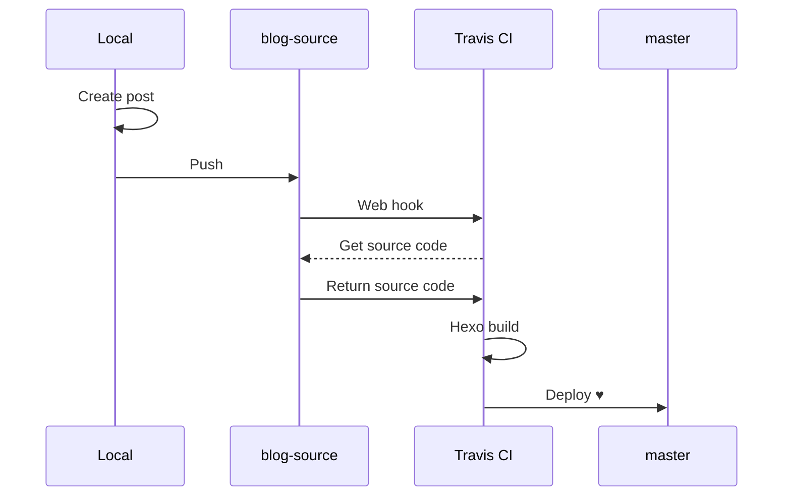

Publishing a new post can be too much if you do it old school `hexo p && hexo d` on the desktop/laptop. What's worse is you can only publish it on a computer with Hexo installed. What if you want to write it anywhere and anytime and even on an iPad? With Travis CI (or any other CI service), each time you push a change to the GitHub repo, a build will kick off on Travis and it run anything you prepared including deploying the updated pages. It took me two nights to figure out (mostly) how to archive it :sweat_smile:, so in this post I will try to write down each step and the tricks within to make everyone's life easier.

_This post is inspired by [kchen's](https://kchen.cc/2016/11/12/hexo-instructions/?utm_source=wechat_session&utm_medium=social&utm_oi=811177518878048256)_

<!-- more -->

---

# What Is Continuous Integration (CI)?

Continuous Integration is the practice of merging in small code changes frequently. It can be taken advantages in Hexo because like these small code changes, posts are published and deployed one at a time.

# Why Travis CI?

As a CI platform, Travis CI automatically build and tests these changes, and it provides immediate feedback on the success of the change. Most importantly, it is free when you use it on your open source projects like Hexo!

> Note:
>
> -  For more details of  the basics you can always go to its [docs](https://docs.travis-ci.com/user/for-beginners/#what-is-continuous-integration-ci).
> - On May 2nd, 2018 Travis CI announced that open source projects will be joining private projects on *travis-ci.com*. But by the time of this post it is still on its beta testing so I will continue using *travis-ci.org* instead. For more details of this change please check on this [artical](https://docs.travis-ci.com/user/migrate/open-source-on-travis-ci-com/).
> - GitHub is also beta testing its own CI/CD service, check it out [here](https://github.com/features/actions)!
>

# Workflow

This diagram shows the process behind the automation:




- Push new post created locally (iPad or laptop) to 'blog-source' branch
- Setup a web hook for this branch on Travis
- Travis detects the push and clones your branch
- Travis builds Hexo
- Travis deploy the results onto 'master' branch

# Setup Travis CI

## Login with GitHub account

You can login Travis CI with GitHub account directly

## Check your HEXO repo on Travis

If you cannot see your repo, click "Sync account".


# Setup local files

## Create .travis.yml

```yaml
language: node_js
node_js: stable
branches:
  only:
  - blog-source #or your source branch name
cache:
  directories:
  - node_modules #cache models to speed up the build
before_install:
- npm install -g hexo-cli
- git clone -b master https://github.com/da0mao/hexo-theme-icarus.git themes/icarus #I forked and modified the them, otherwise clone your theme directly
install:
- npm install
script:
- hexo generate
after_success: #remember to change name, email address, etc.
- git config --global user.name "da0mao"
- git config --global user.email "da0mao@mmail.com"
- sed -i'' - sed -i'' "s~git@github.com:da0mao/da0mao.github.io.git~https://${REPO_TOKEN}@github.com/da0mao/da0mao.github.io.git~" _config.yml
- hexo d
```

## Create environment variable for Travis

Go to GitHub>Settings >> Developer settings >> Personal access tokens >> Generate new token, provide accesses for repo. Then replace `<REPO_TOKEN>` with the token in below:

```bash
$ gem isntall travis
$ winpty ruby `which travis` login
$ travis encrypt 'REPO_TOKEN=<REPO_TOKEN>' --add
```

> Note:
>
> - You will need to install [Ruby](https://www.ruby-lang.org/en/downloads/) if you haven't done so.
> - I tried `$ travis login` to login Travis but it didn't work, thanks to [@glexey](https://github.com/glexey) advised the alternative [here](https://github.com/travis-ci/travis-ci/issues/8250).

This will add below into the .travis.yml file:

```yaml
env:
  global:
    secure: o9kT32NsUwxxxxxxxxxxxxxxxxxxxxxxxxxxxxxx
```

## Update deploy method on _config.yml

```yaml
deploy:
  type: git
  repo: git@github.com:da0mao/da0mao.github.io.git
  branch: master
```

## Push all source to GitHub blog-source branch

Your local files to be pushed should look like below

```
.
├── .travis.yml
├── _config.yml
├── db.json
├── package.json
├── node_modules
├── scaffolds
├── source
└── themes
```

Now you can push them to blog-source branch on GitHub.

```bash
$ git init
$ git checkout -b blog-source
$ git add .
$ git remote add origin https://github.com/da0mao/da0mao.github.io.git
$ git commit -m ‘new post'
$ git push -u origin blog-source
$ git push -f origin blog-source
```


All set! From now on, you can focus on writing the posts and let Travis CI does the rest! Next time if you wish to write a post, simply 1) go to GitHub repo and create a new file on the website; or 2) pull and push from any computer installed with git.

---
# **Update_24Aug2019** 
Further you can replace `- hexo d` with `- gulp` if you have adopted it [Optimize Hexo With Gulp](https://maologue.com/Optimize-Hexo-with-Gulp/). Remember to push `gulpfile.js` to `blog-source` branch, too. 

---

