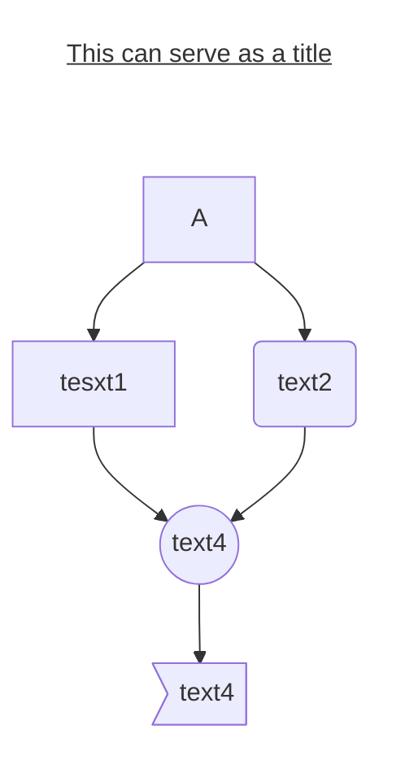
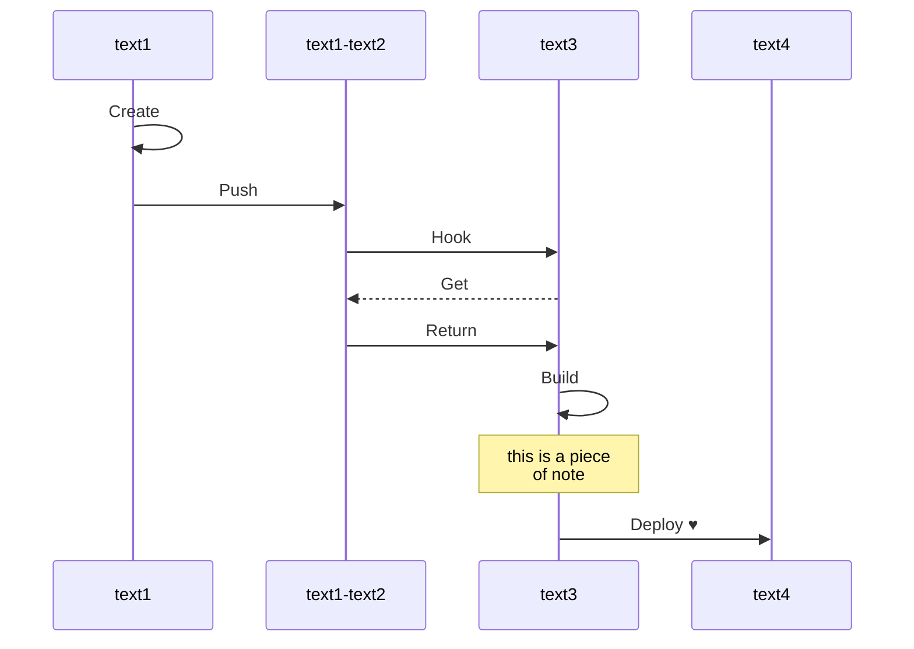
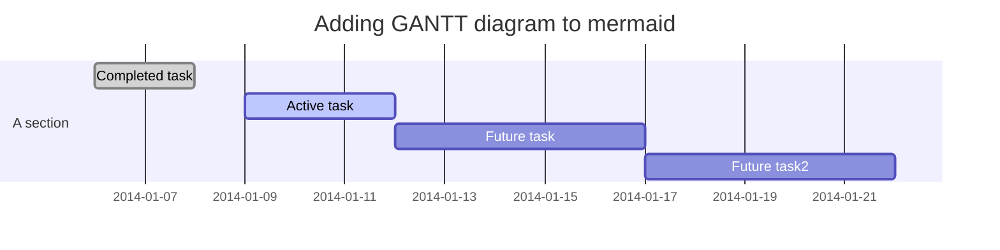

# Install package

`$ yarn add hexo-filter-mermaid-diagrams`

<!-- more -->

# Edit _config.yml
```yml
# mermaid chart
mermaid: ## mermaid url https://github.com/knsv/mermaid
  enable: true  # default true
  version: "7.1.2" # default v7.1.2
  options:  # find more api options from https://github.com/knsv/mermaid/blob/master/src/mermaidAPI.js
    #startOnload: true  // default true
```
# Include mermaid.js in ejs
`\themes\icarus\layout\common\footer.ejs`

_Note: If your theme uses swig or pug files, please refer to [here](https://github.com/webappdevelp/hexo-filter-mermaid-diagrams) for instruction to include mermaid.js_

```javascript
...
...
	//added travis CI status img
	
	</p>
</div>
<div class="level-end">
<% if (has_config('footer.links')) { %>
...
...
<% } %>
//included mermaid
<% if (theme.mermaid.enable) { %>
  <script src='https://unpkg.com/mermaid@<%= theme.mermaid.version %>/dist/mermaid.min.js'></script>
  <script>
	if (window.mermaid) {
	  mermaid.initialize({theme: 'neutral'});
	}
  </script>
<% } %>
</div>
...
...
```

---

# Start using it on your blog!

## flowchart

```
graph TD;
	title[<u>This can serve as a title</u>]
	title-->A
	style title fill:#FFF,stroke:#FFF
	linkStyle 0 stroke:#FFF,stroke-width:0;
    A-->B[tesxt1];
    A-->C(text2);
    B-->D{text3};
    C-->D((text4));
    D-->E>text4];
```



## Sequence diagram

```
sequenceDiagram
    text1->>text1: Create
    text1->>text1#45;text2: Push
    text1#45;text2->>text3: Hook
    text3-->>text1#45;text2: Get
    text1#45;text2->>text3: Return
    text3->>text3: Build
    note over text3: this is a piece<br>of note
    text3->>text4: Deploy #9829;
```



## Gantt diagram

```
gantt
dateFormat  YYYY-MM-DD
title Adding GANTT diagram to mermaid

section A section
Completed task            :done,    des1, 2014-01-06,2014-01-08
Active task               :active,  des2, 2014-01-09, 3d
Future task               :         des3, after des2, 5d
Future task2               :         des4, after des3, 5d
```


## Experimental diagrams and more

See [here](https://mermaidjs.github.io/#/README)


